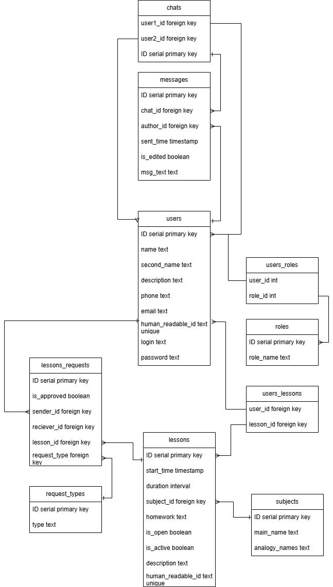

# Tutor_grade_book

## Даталогическая модель

## Для сохранения целостности данных используются следующие ограничения для полей таблиц:
### Регулярными выражениями
+ CHECK (phone ~ '^[0-9]*$') для телефонов
+ CHECK (email ~ '^[0-z]+@([A-z]+\.)+[A-z]{2,4}$') для почты
+ CHECK (name ~ '^[A-z]*$') для имен
+ ...
### Триггеры
+ after_approving_lesson_by_student
+ after_approving_lesson_by_tutor
+ before_insert_lesson_if_not_exists
+ instead_of_delete_lesson

## В целях ускорения работы с таблицами были определены следующие индексы:
+ chats_index для таблицы chats
+ creds_index для таблицы creds
+ user_info_index для таблицы user_info
+ students_index для таблицы students
+ tutors_index для таблицы tutors
+ contacts_index для таблицы contacts
+ lessons_index_on_ID для таблицы lessons
+ lessons_index_on_time для таблицы lessons
+ subjects_index для таблицы subjects
+ student_lessons_requests_index для таблицы student_lessons_requests
+ tutor_lessons_requests_index для таблицы tutor_lessons_requests

Выделенные поля будут меньше всего подвержены перезаписи, что позволит тратить \
минимум времени на пересчет индексов и получать максимум выгоды от их использования при операциях SELECT.

Например, в контексте прецедента 